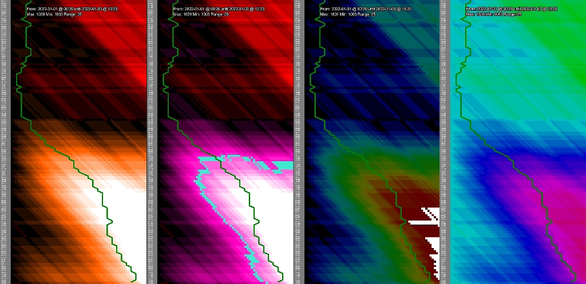
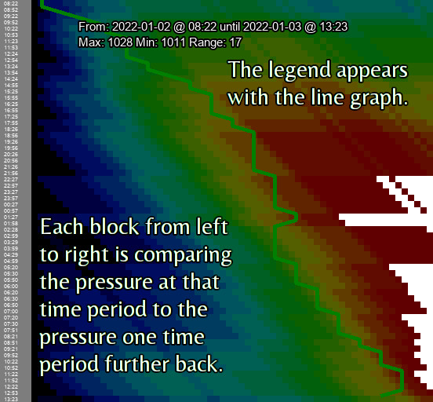
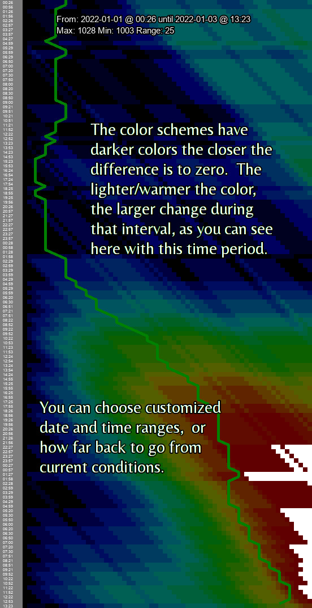

barometers
==========

# A different way at looking at historical barometric data for a location.


* `barometers.py` - Produce graphs and various charts of historical barometric data 
for a location to aid in visualization of pressure changes quickly for (possible) 
prediction of health effects from the change in weather pressure.  
* `just_pressure.sh` - a subset of `weather.sh` that just gets and saves pressure data. Will use same cache as `weather.sh` if installed.  

  


## Contents
 1. [About](#1-about)
 2. [License](#2-license)
 3. [Prerequisites](#3-prerequisites)
 4. [Installation](#4-installation)
 5. [Usage](#5-usage)
 6. [Charts](#6-charts)


 9. [TODO](#9-todo)

***

## 1. About

I suffer from Willis-Ekbom Syndrome, commonly (and in my case, wrongly) called 
"Restless Legs Syndrome".  In my case, I experience it as *pain*, and it seemed 
to be significantly worse when there was a rapid change in the barometric pressure.

I know a number of other people who experience symptoms when the pressure changes 
quickly - or at least, it *seems* to correlate.  I noticed that I could see the correlation 
when I looked back at graphs, but I had a hard time *predicting* when I'd have bad 
symptoms from publicly available data and graphs.

Until it hit me that bodily symptoms - particularly around pressure - take *time* 
to adjust to changes in the environment. [I made a rough bash script that charted 
change over time, and it seems to provide some degree of predictive ability](https://ideatrash.net/2021/12/data-hiding-in-plain-sight-pain-and-pressure-changes-over-time.html). 

So then I taught myself python properly in a week and rewrote the program so it 
could provide more visualizations of the data, and am making it available so that others can do the 
same.

### So what am I looking at?

A picture is worth a thousand words, especially when that picture has annotations on it.  

  
  

## 2. License

This project is licensed under the MIT license. For the full license, see `LICENSE`.

## 3. Prerequisites

### barometers.py

 * [The Pillow (or PIL) library](https://pillow.readthedocs.io/en/stable/installation.html)
    - Written and tested using `python3-willow` 1.4-1 from Debian stable (e.g `sudo apt-get python3-willow`)

### just_pressure.sh

 * OpenWeatherMap API key ([http://openweathermap.org/appid](http://openweathermap.org/appid)).
 * Bash shell ≥ 4.2.
 * `bc` basic calculator for floating point arithmetic. Can be found in the 
 `bc` package on major Linux distributions.
 * `curl` command-line tool for getting data using HTTP protocol. cURL can be 
 found in the `curl` package on major Linux distributions.
 * `grep` command-line tool used for parsing downloaded XML data. `grep` can 
 be found in the `grep` package on major Linux distributions.
 * `jq` command-line tool for parsing JSON data. `jq` can be found in the `jq` 
 package on major Linux distributions.
 * `tr` command-line tool for parsing JSON data. `tr` can be found in the `tr` 
 package on major Linux distributions.
 * `awk` command-line tool for parsing JSON data. `awk` can be found in the 
 `awk` package on major Linux distributions. 

## 4. Installation

### `barometers.py`

* Install the PIL/Pillow library (above version 4; the version "1.4-1" in Debian stable 
is sufficient).  

* Create a directory "raw" and "cache" underneath the program directory.

### `just_pressure.sh`

* Place `just_pressures.sh` in the same directory as `barometers.py`.

If you have already installed the [weather.sh](https://uriel1998.github.io/weather.sh/) script, 
then you are done.  `just_pressure.sh` is a very cut-down version of the `weather.sh` 
script that simply collects barometric data from OpenWeatherMap when run and puts it 
in a format that `barometers.py` expects.  I fully expect to rewrite this and bundle 
it into `barometers.py` shortly. 

If you do **not** have `weather.sh` installed, do the `weather_sh.rc` portion so you 
have data to analyze and visualize.

#### weather_sh.rc

Copy (and edit, as appropriate) the `weather_sh.rc` file to `$HOME\.config\weather_sh.rc`.   

* The first line is the OpenWeatherMap API key  
* The second line is your default location. (See note below)  

No other lines are necessary if you are just using `just_pressure.sh` and not the 
full `weather.sh` script, but will cause no harm if they're there.

Alternately, `just_pressure.sh` can be started with the following command line 
options:

 * `-k` Specifies OpenWeatherMap API key from the command-line.
 * `-l city_name` Sets the city for manual weather lookup. (see note below)

_Note: If the OpenWeatherMap API key is specified from the command-line, it 
will override the API key set in the file._

_Note: It is **STRONGLY** recommended to use the City ID from OpenWeatherMap 
instead of a city name. Instructions on finding your city's City ID 
[here](https://www.dmopress.com/openweathermap-howto/) ._

## 5. Usage

* Call `just_pressures.sh` at regular intervals. Every 30 minutes from a cron job 
is a good choice.  You *must* specify your API key and (preferably) City ID in the 
configuration file or at runtime using the two switches above.  It will create/place 
a store of data in the `raw` subdirectory you created.  A sample set of data is 
provided.

* Whenever you like, run `python ./barometers.py` with the appropriate command-line 
switches (below).  

* _`barometers.py` will automatically read in text files from the `raw` subdirectory._ 
The filenames in that directory should have the City ID first in the filename, 
optionally followed by an underscore and anything else you need to keep track of 
where the data came from, e.g. `4509884_data.txt` and `4509884_from_phone_sensor_data.txt`.

* It checks incoming data (by default limited to the last 256 records in each 
file) against a binary cache file in the `cache` subdirectory to avoid duplicates. 
It also cleans out rows with empty values removes duplicate entries within the same 
minute (if such exist). 

* It compares the pressure at each interval against the pressure reading out to 
64 intervals back, and stores the entries in the cache, and provides a summary 
of the data in the cache.

```
Reading in cache for location 4509884
Reading in /home/USER/barometers/raw/4509884.txt
Reading in cache for location 4509884
Reading in /home/USER/barometers/raw/4509884_data.txt
We have 18572 records stored for 4509884,
From 23:30 at 2020-12-17 to 17:56 at 2022-01-03
```

* Output in charts and results of calculations is controlled by command line switches. 
A detailed breakdown follows this summary:

```
usage: barometers.py [-h] [-d NUM_OUTPUT] [-a NUM_INPUT] [-c] [-l] [-s SCHEME]
                     [-S] [-A] [-b START_DATE] [-e END_DATE] [-f FN_STEM] [-v]
                     [-i VERIFY_INTERVAL] [-t TOLERANCE_RANGE] [-m]
                     [-B BOUT_HERE]

optional arguments:
  -h, --help            show this help message and exit
  -d NUM_OUTPUT, --display-records NUM_OUTPUT
                        number of records back to show
  -a NUM_INPUT, --add-records NUM_INPUT
                        max number of records to add from input files
  -c, --show-calc       Show calc on stdout
  -l, --line-graph      Produce line graph overlay
  -s SCHEME, --scheme SCHEME
                        Color scheme - default, wide, alt, original
  -S, --signed-values   Produce signed value chart
  -A, --abs-values      Produce abs value chart
  -b START_DATE, --begin-date START_DATE
                        Provide the start date for chart or calculation data.
  -e END_DATE, --end-date END_DATE
                        Provide the end date for chart or calculation data;
                        optional, only makes sense with --begin-date.
  -f FN_STEM, --file FN_STEM
                        Stem for output filename, defaults to
                        out_[abs|signed].png
  -v, --verify          Verify interval ranges
  -i VERIFY_INTERVAL, --interval VERIFY_INTERVAL
                        Expected interval in seconds, only makes sense with -v
  -t TOLERANCE_RANGE, --tolerance TOLERANCE_RANGE
                        Acceptable range in seconds, only makes sense with -v
  -m, --make-sure       Make sure calculations in range take into account
                        verified interval ranges.
  -B BOUT_HERE, --bout-here BOUT_HERE
                        Where to output weather location from.

```

### Verification of data

**Important** : For best results, remove all files in `./cache/*` before using 
the verification functions.

The program can - with the specification of the verification switch - verify that 
the time between intervals is roughly the same (default tolerance of +- 5 min), 
detect missing intervals (e.g. from a power outage), and detect excess intervals 
(e.g. readings 15 minutes apart when you want them 30 minutes apart).  When displaying 
charts and --verify is on, if erroneous data is found, it will automatically redo 
the calculations for that section of data and/or shrink the range to omit bad data.

  -v, --verify          Verify interval ranges
  -i VERIFY_INTERVAL, --interval VERIFY_INTERVAL
                        Expected interval in seconds, only makes sense with -v
  -t TOLERANCE_RANGE, --tolerance TOLERANCE_RANGE
                        Acceptable range in seconds, only makes sense with -v
  -m, --make-sure       Make sure calculations in range take into account
                        verified interval ranges.
                        
You may get a *lot* of extra screen output with verify on - see 
`console_output_with_verify.txt` in the `examples` directory.

### Controlling addition of data  

By default, it only reads in the last 256 rows of data from each file in the `raw` 
subdirectory.  If you wish to change this behavior, use the following switch:

* -a NUM_INPUT, --add-records NUM_INPUT = max number of records to add from input files  

### Controlling the amount of output  

You can amass a *lot* of data, so there are several ways to control the amount of 
output shown.  The default number of records charted/shown is 256 if unspecified 
in any way.

- If the start date is given (in YYYY-mm-dd format), and the end date is set, it 
will show between those dates inclusive (or to the end of the file).
- If the start date is given and the number of records is set, it will show from 
beginning of the start date and show that many records (or to the end of the file).
- If the start date is given and no other criteria given, it will show from the 
beginning of the start date to the end of the data.  

* -d NUM_OUTPUT, --display-records NUM_OUTPUT = limits the number of records to chart/show.  
* -b START_DATE, --begin-date START_DATE = Provide the start date for chart or calculation data in YYYY-mm-dd format.  
*  -e END_DATE, --end-date END_DATE = Provide the end date for chart or calculation data in YYYY-mm-dd format; only used with --begin-date.  

### Controlling the output of data  

#### Location 

`barometers.py` can choose which cached data to output by using this switch:

* -B BOUT_HERE, --bout-here BOUT_HERE = City code of cache to output weather location from.

#### Calculation data  

`barometers.py` can show it's calculated data on STDOUT if you wish to review it 
(example output follows). Use the following command-line switch:

* -c, --show-calc = Show calc on stdout  

The data structure is:

pressures = [time of collection (epoch),date of collection (YYYY-mm-dd),time of collection (HH:MM),pressure imperial,pressure metric, calc[64]]  

Example output:  
```
2022-01-03 @ 16:25 : (0, 0, 0, 0, 0, 0, 0, -1, -1, -1, -1, 0, 0, 0, 1, 1, 2, 2, 2, 2, 3, 3, 3, 3, 4, 4, 4, 4, 5, 5, 5, 5, 5, 5, 4, 4, 5, 5, 5, 5, 5, 5, 6, 6, 6, 6, 6, 6, 6, 7, 7, 8, 8, 8, 8, 9, 9, 10, 11, 11, 12, 12, 12, 12)
2022-01-03 @ 16:55 : (0, 0, 0, 0, 0, 0, 0, 0, -1, -1, -1, -1, 0, 0, 0, 1, 1, 2, 2, 2, 2, 3, 3, 3, 3, 4, 4, 4, 4, 5, 5, 5, 5, 5, 5, 4, 4, 5, 5, 5, 5, 5, 5, 6, 6, 6, 6, 6, 6, 6, 7, 7, 8, 8, 8, 8, 9, 9, 10, 11, 11, 12, 12, 12)
2022-01-03 @ 17:25 : (0, 0, 0, 0, 0, 0, 0, 0, 0, -1, -1, -1, -1, 0, 0, 0, 1, 1, 2, 2, 2, 2, 3, 3, 3, 3, 4, 4, 4, 4, 5, 5, 5, 5, 5, 5, 4, 4, 5, 5, 5, 5, 5, 5, 6, 6, 6, 6, 6, 6, 6, 7, 7, 8, 8, 8, 8, 9, 9, 10, 11, 11, 12, 12)
2022-01-03 @ 17:56 : (0, 0, 0, 0, 0, 0, 0, 0, 0, 0, -1, -1, -1, -1, 0, 0, 0, 1, 1, 2, 2, 2, 2, 3, 3, 3, 3, 4, 4, 4, 4, 5, 5, 5, 5, 5, 5, 4, 4, 5, 5, 5, 5, 5, 5, 6, 6, 6, 6, 6, 6, 6, 7, 7, 8, 8, 8, 8, 9, 9, 10, 11, 11, 12)   

```

## 6. Charts

`barometers.py` can chart the change in either absolute values of change, signed 
values of change, or both.  It can also (additionally) provide a line graph and 
legend of the values on the chart that may help. Some examples follow the list of 
switches; try the different color schemes to see what works better for you.  You 
can see some pregenerated examples in the `examples` directory of this repository.  

**The line graph auto-scales to fit the generated chart.**

```
  -l, --line-graph      Produce line graph overlay
  -s SCHEME, --scheme SCHEME
                        Color scheme - default, wide, alt, original
  -S, --signed-values   Produce signed value chart
  -A, --abs-values      Produce abs value chart
  -f FN_STEM, --file FN_STEM
                        Stem for output filename, defaults to
                        out_[abs|signed].png

```

### Examples  

Produce a chart of the last 256 intervals, only of absolute values of pressure change, 
using the default color scheme, with overlaid line graph and legend, 
named `out_abs.png` in the current directory:

`python ./barometers.py -A -l`

Produce a chart of the last 256 intervals, of absolute values *and* signed values 
of pressure change, using the default color scheme, with overlaid line graph and legend, 
named `out_abs.png` and `out_signed.png` in the current directory:

`python ./barometers.py -A -S -l`

Produce a chart of the last 512 intervals, only of absolute values of pressure change, 
using the "wide" color scheme, with overlaid line graph and legend, 
named `foo_abs.png` in the current directory:

`python ./barometers.py -A -l -f foo -s wide -d 512`

Produce a chart of data from 2021-12-30 through 2022-01-01, only of signed 
values of pressure change, using the "original" color scheme, with overlaid line 
graph and legend, named `bar_signed.png` in the current directory:

`python ./barometers.py --signed-values -l -f bar -s original -b 2021-12-30 -e 2022-01-01`

## 7. ToDo

* Rewrite `just_pressure` to be part of the python program and be simpler to set up.  
* Check intervals for (roughly) equivalent time passage when displaying - done, write into README
* Check intervals for (roughly) equivalent time passage ON CALCULATIONS (there is no checking now)  
* Create *only* a line graph.  
